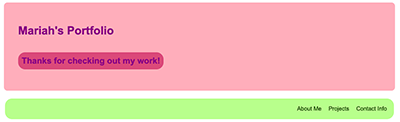
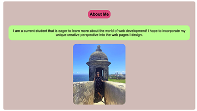
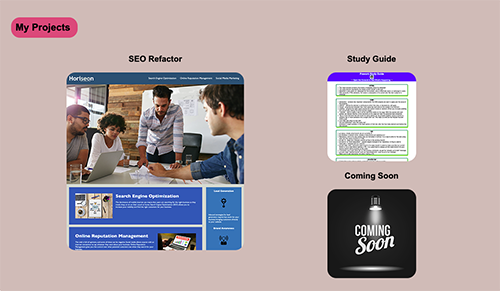

# my-portfolio

## Table of Contents
- [Description](#Description)
- [Visuals](#Visuals)

## Description
For this project, I created a personal portfolio using HTML and CSS in order to showcase some of my work. When you view my portfolio website, you will see a header followed by a navigation bar equipped with links that will take you to the specified content sections of my portfolio. If you navigate to the about-me section, you will find a short bio as well as a photo of me. If you navigate to the projects section, you will find one project that I have chosen to highlight as well as two additional projects that I have made. Finally, if you navigate to the contact section, you will find links to my personal GitHub, Linkedin and Instagram accounts.
## Visuals

